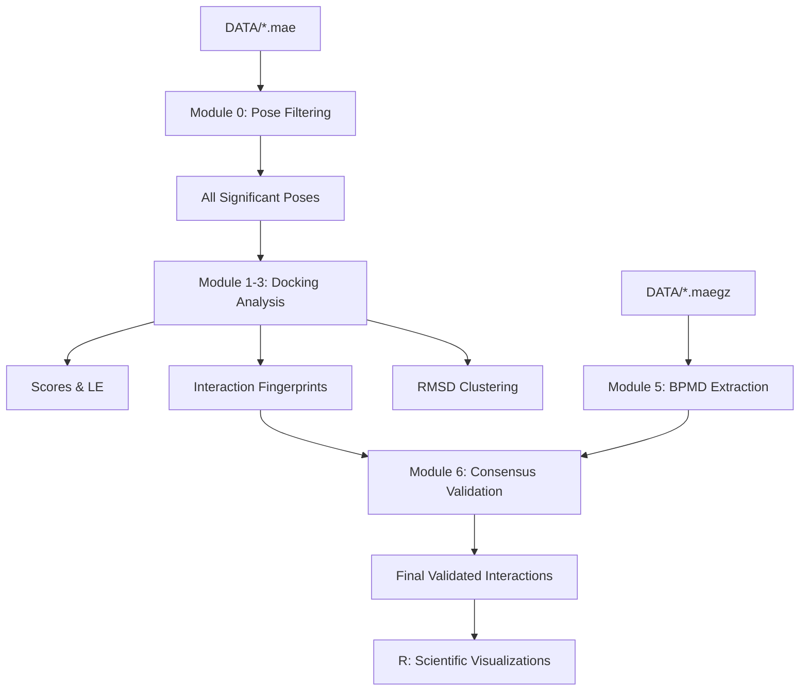

# Integrated Docking & BPMD Analysis Pipeline

[](https://github.com/kostassdrakas01/Docking-BPMDComparativeAnalysis)
[](https://www.schrodinger.com/)

An automated, physics-informed pipeline for post-processing Schrödinger Glide docking results and validating them via Desmond Binding Pose Metadynamics (BPMD). This workflow distinguishes between reproducible bioactive orientations and stochastic docking artifacts.

---

## 🧬 Scientific Objective

In computational drug design, docking algorithms often produce multiple "fuzzy" binding modes with similar scores. This pipeline solves the **Pose Fidelity Problem** by integrating dynamic stability metrics. It identifies **Structural Anchors**—residues that maintain persistent interactions during force-biased metadynamics simulations.

---

## 🛠 Workflow Architecture



---

## 🚀 Quick Start

### 1. Preparation
Place your Glide docking results (`.mae`) and your Desmond BPMD results (`-out.maegz`) into the `DATA/` directory.

### 2. Execution
Run the master pipeline using the Schrödinger environment:

```bash
# Run full analysis on all data in DATA/
$SCHRODINGER/run run_docking_pipeline.py

# Run a fresh analysis (cleans previous results first)
$SCHRODINGER/run run_docking_pipeline.py --clean
```

---

## 📊 Theory of Operation & Metrics

### Docking Significance (Emodel)
*   **Emodel**: The most reliable metric for intra-ligand pose selection. The pipeline selects the top-10 poses per ligand based on Emodel to ensure physical significance before performing detailed interaction analysis.

### Dynamic Stability (BPMD)
*   **PoseScore**: A measure of global geometric stability. 
    *   `> 1.0`: Stable fit.
    *   `> 1.5`: **High Fidelity** (The orientation is highly reproducible).
*   **Persistence**: Measures the "lifetime" of specific residue contacts.
    *   `> 1.0`: The interaction survived the entire duration of the force-biased trials.

### Structural Anchor Profiles
The pipeline generates stacked bar charts showing the interaction frequency of residues across the ensemble. This identifies which residues are consistent anchors (e.g., ASP125) versus transient contacts.

---

## 📂 Directory Structure

*   **`00_Significant_Poses/`**: Collation of physically relevant poses.
*   **`02_Interaction_Analysis/`**: Residue contact maps and hotspot identification.
*   **`04_Visualizations/`**: High-impact plots for scientific reports:
    *   `ligand_interaction_profiles.png`: Stacked bar charts of residue importance.
    *   `scientific_validation_landscape.png`: PoseScore vs. Persistence.
    *   `docking_refinement_comparison.png`: Energy correction (Glide vs. BPMD).
*   **`05_BPMD_Validation/`**: The "Source of Truth" CSVs for binding mode validation.

---

## 💻 Requirements

*   **Schrödinger Suite** (2021-2 or newer recommended).
*   **R** with the following packages: `ggplot2`, `dplyr`, `tidyr`, `ggrepel`.
*   **Python 3** (Included in Schrödinger environment).

---

## 👨‍🔬 Authors
**Konstantinos Drakas**  
Integrated Workflow for Covalent and Non-Covalent Binding Analysis.
